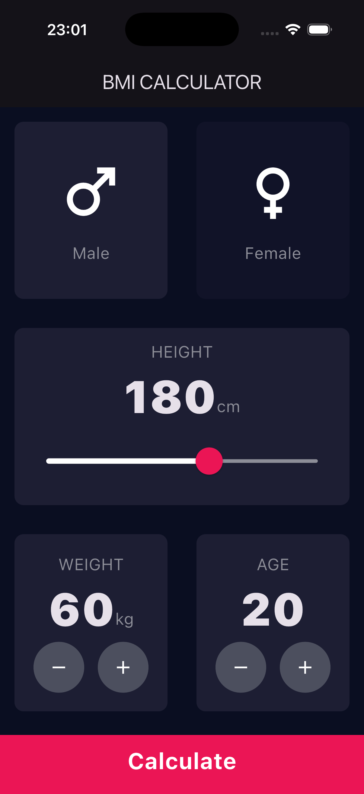
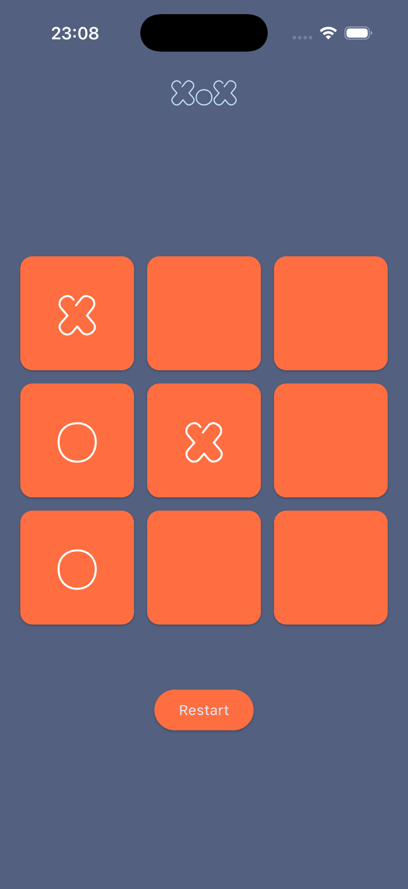
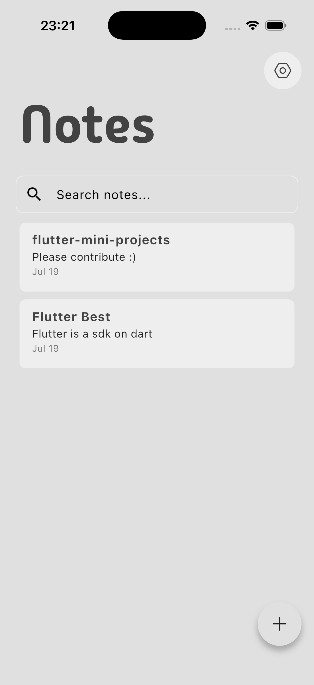
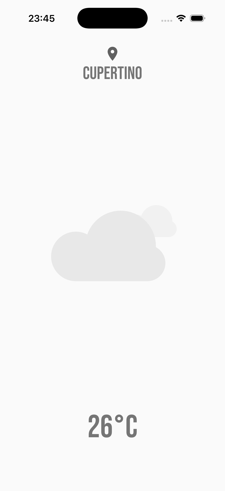

# Flutter Mini Projects

<p align="center">
  
  
  
  
  
</p>

Seven small, self-contained Flutter apps — each one complete, runnable, and built
around a handful of new concepts.

<p align="center">
  
  
  
  
</p>

<p align="center">
  <em>BMI Calculator · XOX Game · Notes App · Weather App</em>
</p>

These are the small projects I built while teaching myself Flutter, going from a
`setState` calculator to a notes app backed by a local database. I've cleaned them
up and documented each one, so you can pick a project, read through the code, and
build something similar yourself.

## 📚 Projects

| # | Project | Level | What it teaches |
|---|---------|-------|-----------------|
| 01 | [BMI Calculator](projects/01_bmi_calculator) | 🟢 Beginner | `setState`, reusable widgets, `Slider`, `enum`, passing data between screens with `Navigator` |
| 02 | [Calculator](projects/02_calculator) | 🟢 Beginner | Adding a pub package, `MediaQuery` sizing, button styling, expression parsing with `math_expressions` |
| 03 | [XOX Game](projects/03_xox_game) | 🟢 Beginner | `GridView.builder`, list-based game state, win detection, `AlertDialog`, custom fonts |
| 04 | [Quiz App](projects/04_quiz_app) | 🟢 Beginner | Modeling data with a Dart class, `RadioListTile`, building widgets from a list, scoring |
| 05 | [Study Tracker](projects/05_study_tracker) | 🟡 Intermediate | Persistence with `shared_preferences` + JSON, charts with `fl_chart`, date picker, undo via `SnackBar` |
| 06 | [Notes App](projects/06_notes_app) | 🔴 Advanced | `provider` state management, Isar local database, full CRUD + search, swipe-to-delete, theme switching |
| 07 | [Weather App](projects/07_weather_app) | 🟡 Intermediate | REST API calls, `async`/`await`, JSON parsing, geolocation permissions, Lottie animations |

Projects are roughly ordered by difficulty. If you're brand new to Flutter, start
at 01 and work your way down — each one assumes you're comfortable with what came
before it.

## 🚀 Getting Started

You'll need the [Flutter SDK](https://docs.flutter.dev/get-started/install)
installed. Each project declares its own Dart SDK constraint in `pubspec.yaml`;
a recent stable Flutter release will run all of them.

```bash
# 1. Clone the repo
git clone https://github.com/yakupkahraman/flutter-mini-projects.git
cd flutter-mini-projects

# 2. Pick a project
cd projects/01_bmi_calculator

# 3. Generate the platform folders (see note below)
flutter create --platforms=android,ios,macos,windows,linux,web .

# 4. Install dependencies and run
flutter pub get
flutter run
```

> **Why step 3?** Only `lib/`, `assets/` and `pubspec.yaml` are committed for each
> app — the generated `android/`, `ios/`, `web/` … folders are left out to keep the
> repo small. `flutter create .` regenerates them without touching your `lib/`
> code. Pass only the platforms you actually need.

Two projects need an extra step:

- **[07 Weather App](projects/07_weather_app)** — needs a free
  [OpenWeatherMap](https://openweathermap.org/api) API key and location
  permissions.
- **[06 Notes App](projects/06_notes_app)** — uses generated Isar code, so run
  `dart run build_runner build` if you change the model.

Each project's own README has the full details.

## 🛠️ Tech Stack

Flutter · Dart · `provider` · `isar_community` · `shared_preferences` ·
`fl_chart` · `http` · `geolocator` · `lottie`

## 🤝 Contributing

Found a bug, or want to add a project? Issues and pull requests are welcome — see
[CONTRIBUTING.md](CONTRIBUTING.md) for the folder naming convention, what to commit,
and the README structure each project follows.

## 📄 License

MIT — see [LICENSE](LICENSE). Use these projects however you like.
