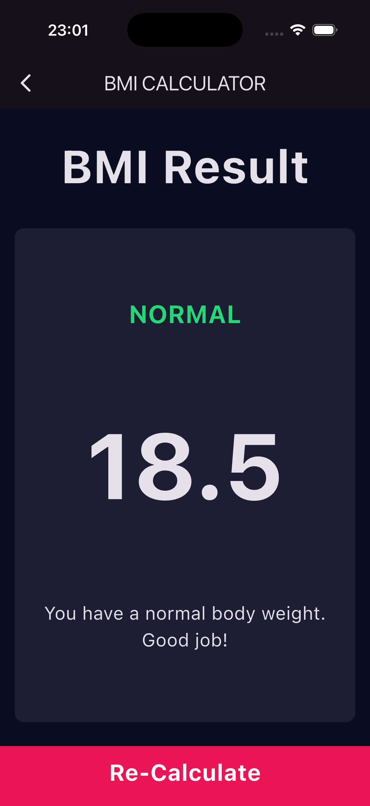

# BMI Calculator

🟢 **Beginner** · A simple Flutter app for calculating Body Mass Index (BMI) from
height and weight.

Pick your gender, drag the height slider, tap `+`/`−` for weight and age, then hit
**Calculate** to see your BMI on a second screen along with a short piece of advice.

## 📸 Screenshots

<p align="center">
  
  
</p>

## What You'll Learn

- How to build a multi-screen Flutter app
- How to use custom reusable widgets
- How to work with `StatefulWidget` and `setState`
- How to use sliders, buttons, and gesture handling in Flutter
- How to pass data between screens with `Navigator`
- How to calculate and display a BMI result based on user input
- How to track a fixed set of choices with an `enum` instead of booleans
- How to keep colors and text styles in one shared `constants.dart` file
- How to split layouts into proportional areas with `Row`, `Column` and `Expanded`

## Project Structure

```
lib/
├── components/          # Small reusable widgets
│   ├── bottom_container.dart   # The pink "Calculate" bar
│   ├── circular_button.dart    # Round +/- buttons
│   ├── content_box.dart        # Icon + label used in the gender cards
│   └── reusable_box.dart       # The rounded card every section sits in
├── pages/
│   ├── input_page.dart  # All the inputs and the app's state
│   └── result_page.dart # Displays the calculated result
├── constants.dart       # Shared colors and text styles
├── functions.dart       # BmiCalculator — the math, with no UI in it
└── main.dart
```

The useful idea here: **`functions.dart` contains no Flutter UI code.** Keeping
the calculation separate from the widgets makes it easy to read, and easy to test.

## Key Concepts

### Reusable widgets

Rather than repeating the same `Container` decoration four times, `ReusableBox`
takes a color and a child widget:

```dart
class ReusableBox extends StatelessWidget {
  const ReusableBox({super.key, required this.colour, required this.cardChild});

  final Color colour;
  final Widget cardChild;

  @override
  Widget build(BuildContext context) {
    return Container(
      margin: const EdgeInsets.all(16),
      decoration: BoxDecoration(
        color: colour,
        borderRadius: BorderRadius.circular(10),
      ),
      child: cardChild,
    );
  }
}
```

### An `enum` for the selected gender

An `enum` makes invalid states impossible — there's no way to be "both" or
"neither", the way two separate `bool`s would allow:

```dart
enum Gender { male, female }

Gender selectedGender = Gender.male;

// Later, the card's color depends on which one is selected:
colour: selectedGender == Gender.male ? cActiveCardColor : cInactiveCardColor,
```

### Passing data to the next screen

`ResultPage` receives everything it needs through its constructor, so it can stay
a `StatelessWidget`:

```dart
Navigator.push(
  context,
  MaterialPageRoute(
    builder: (context) => ResultPage(
      bmi: calc.result(),
      resultText: calc.getText(),
      advice: calc.getAdvice(),
      textColor: calc.getTextColor(),
    ),
  ),
);
```

`Navigator.pop(context)` on the result screen goes back to the inputs.

## Getting Started

Prerequisites:

- Flutter SDK installed

Install dependencies:

```bash
flutter pub get
```

To add or regenerate platform support, run:

```bash
flutter create --platforms=android,ios,macos,windows,linux,web .
```

Run the app:

```bash
flutter run
```

## Try It Yourself

- Add a BMI category color bar to the result page
- Let the user switch between metric (cm/kg) and imperial (ft/lb)
- Save previous results and show them as a history list
