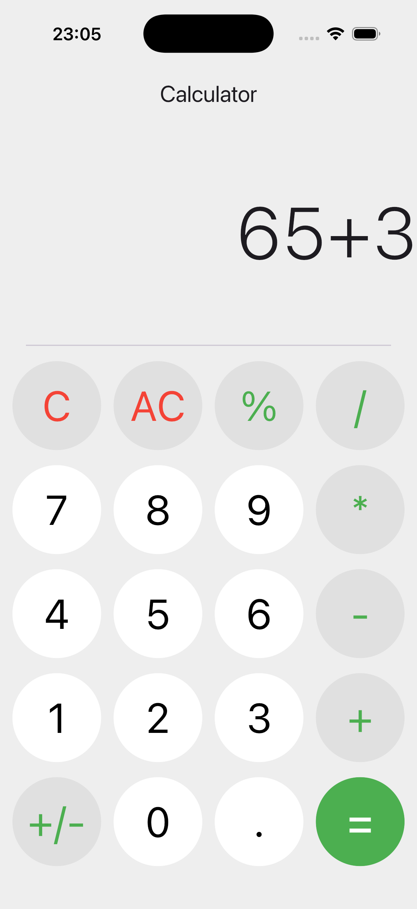

# Calculator

🟢 **Beginner** · A simple Flutter calculator app.

Tap digits and operators to build an expression, then press `=` to evaluate it.
`C` deletes the last character, `AC` clears everything, and `+/-` flips the sign.

## 📸 Screenshots

<p align="center">
  
</p>

## What You'll Learn

- How to add a package to `pubspec.yaml`
- How to manage UI state with `StatefulWidget` and `setState`
- How to extract repeated UI into reusable widgets (see `lib/components/buttons.dart`)
- How to use the `math_expressions` package to evaluate expressions
- How to run a Flutter app locally
- How to size widgets relative to the screen with `MediaQuery`
- How to style buttons with `ButtonStyle` and `WidgetStatePropertyAll`
- How to handle invalid input with `try`/`catch` so the app never crashes

## Project Structure

```
lib/
├── components/
│   └── buttons.dart   # NumberButton, OperateButton, EraserButton
├── pages/
│   └── home_page.dart # The display, the keypad, and all the state
└── main.dart
```

The entire app state is a **single string**:

```dart
String operation = "";
```

Every digit or operator just appends to it, and `=` parses that string. Starting
with the simplest state that works is usually the right instinct.

## Adding a Package in `pubspec.yaml`

To use a package in this project, add it under `dependencies` in `pubspec.yaml`:

```yaml
dependencies:
  flutter:
    sdk: flutter
  math_expressions: ^2.6.0
```

After editing the file, fetch the packages with:

```bash
flutter pub get
```

## Using `math_expressions`

The `math_expressions` package lets you parse and evaluate math expressions entered by the user.

Example:

```dart
import 'package:math_expressions/math_expressions.dart';

final parser = ShuntingYardParser();
final expression = parser.parse('2+3*4');
final contextModel = ContextModel();
final result = expression.evaluate(EvaluationType.REAL, contextModel);

print(result); // 14.0
```

In the calculator app, the entered text is parsed, evaluated, and then shown on the screen as the final result.

Users can type things like `5//2` or `3+`, which aren't valid expressions — so the
evaluation is wrapped in a `try`/`catch`, and the result is checked for infinity
(that's what `1/0` produces) before being displayed:

```dart
try {
  final parser = ShuntingYardParser();
  final expression = parser.parse(operation);
  final result = expression.evaluate(EvaluationType.REAL, ContextModel());

  if (!result.isFinite) {
    operation = "Error";
  } else {
    // Show 4 instead of 4.0 when the result is a whole number
    operation = result == result.roundToDouble()
        ? result.toInt().toString()
        : result.toString();
  }
} catch (e) {
  operation = "Error";
}
```

## Sizing Buttons with `MediaQuery`

The keypad has four columns, so each button is sized as a fraction of the screen
width instead of a hardcoded number. That keeps the layout working on both a
phone and a tablet:

```dart
double deviceWidth = MediaQuery.of(context).size.width;

// ...
minimumSize: WidgetStatePropertyAll(Size(deviceWidth / 4 - 15, 100)),
```

## Getting Started

Prerequisites:

- Flutter SDK installed

Install dependencies:

```bash
flutter pub get
```

To add or regenerate platform support, run:

```bash
flutter create --platforms=android,ios,macos,windows,linux,web .
```

Run the app:

```bash
flutter run
```

## Try It Yourself

- Show the running expression above the result, like the iOS calculator
- Keep a scrollable history of past calculations
- Prevent invalid input (two operators in a row, more than one decimal point)
