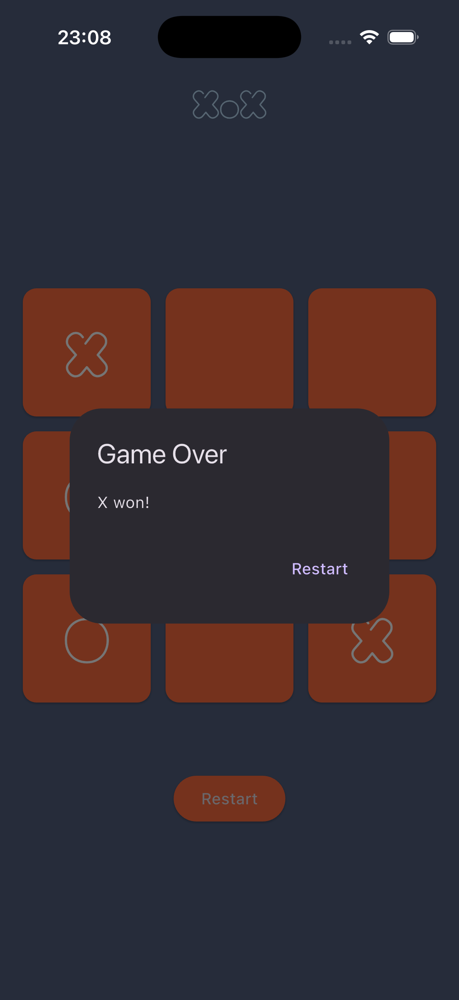

# XOX Game

🟢 **Beginner** · A Flutter-based XOX (tic-tac-toe) game for two players on one
device.

Players alternate tapping cells on a 3×3 grid. When someone gets three in a row —
or the board fills up — a dialog announces the result and offers a restart.

## 📸 Screenshots

<p align="center">
  
  
</p>

## What You'll Learn

- How to build a simple game with Flutter
- How to manage complex UI state with `StatefulWidget` and `setState`
- How to add fonts in `pubspec.yaml`
- How to show a game-over state with `AlertDialog`
- How to handle turn-based gameplay and win detection
- How to build a grid of widgets with `GridView.builder`
- How to represent a 2D board as a flat `List`
- How to safely show a dialog after a frame with `addPostFrameCallback`

## Project Structure

```
lib/
├── pages/
│   └── home_page.dart # Board state, game rules, and the grid UI
└── main.dart
assets/
└── fonts/
    └── MoiraiOne.ttf
```

## Key Concepts

### The board is a flat list

A 3×3 grid doesn't need a list of lists. Nine strings are enough, and it keeps
both the win check and `GridView` simple:

```dart
List<String> board = List.filled(9, "");
String currentPlayer = "X";
```

Index `0` is the top-left cell and index `8` is the bottom-right one.

### Drawing the grid

`GridView.builder` builds cells on demand. `crossAxisCount: 3` gives three
columns, and `shrinkWrap: true` lets the grid size itself to its content so it can
live inside a `Column`:

```dart
GridView.builder(
  gridDelegate: const SliverGridDelegateWithFixedCrossAxisCount(
    crossAxisCount: 3,
    mainAxisSpacing: 5,
    crossAxisSpacing: 5,
  ),
  itemCount: 9,
  shrinkWrap: true,
  padding: const EdgeInsets.all(16),
  itemBuilder: (context, index) {
    return GestureDetector(
      onTap: () => _handleTap(index),
      child: Card(/* shows board[index] */),
    );
  },
)
```

### Checking for a win

All eight winning lines are listed as index triples, then compared against the
player who just moved:

```dart
const winningCombos = [
  [0, 1, 2], [3, 4, 5], [6, 7, 8], // rows
  [0, 3, 6], [1, 4, 7], [2, 5, 8], // columns
  [0, 4, 8], [2, 4, 6],            // diagonals
];

for (var combo in winningCombos) {
  if (board[combo[0]] == currentPlayer &&
      board[combo[1]] == currentPlayer &&
      board[combo[2]] == currentPlayer) {
    return true;
  }
}
```

If nobody won and the board has no empty cells left (`!board.contains("")`), it's
a draw.

### Showing the dialog at the right time

Calling `showDialog` directly inside `setState` runs it while the widget tree is
still building. `addPostFrameCallback` waits until the current frame is done, and
the `mounted` check makes sure the widget is still on screen:

```dart
if (winner.isNotEmpty) {
  WidgetsBinding.instance.addPostFrameCallback((_) {
    if (mounted) {
      _showGameOverDialog();
    }
  });
}
```

## Adding a Custom Font

Drop the `.ttf` file into `assets/fonts/` and declare it in `pubspec.yaml`:

```yaml
flutter:
  uses-material-design: true

  fonts:
    - family: MoiraiOne
      fonts:
        - asset: assets/fonts/MoiraiOne.ttf
          weight: 900
```

Then use the family name in any `TextStyle`:

```dart
Text('XoX', style: TextStyle(fontFamily: 'MoiraiOne', fontSize: 30))
```

## Getting Started

Prerequisites:

- Flutter SDK installed

Install dependencies:

```bash
flutter pub get
```

To add or regenerate platform support, run:

```bash
flutter create --platforms=android,ios,macos,windows,linux,web .
```

Run the app:

```bash
flutter run
```

## Try It Yourself

- Show whose turn it is above the board
- Keep a running score across rounds
- Highlight the three winning cells before the dialog appears
- Add a single-player mode with a simple computer opponent
