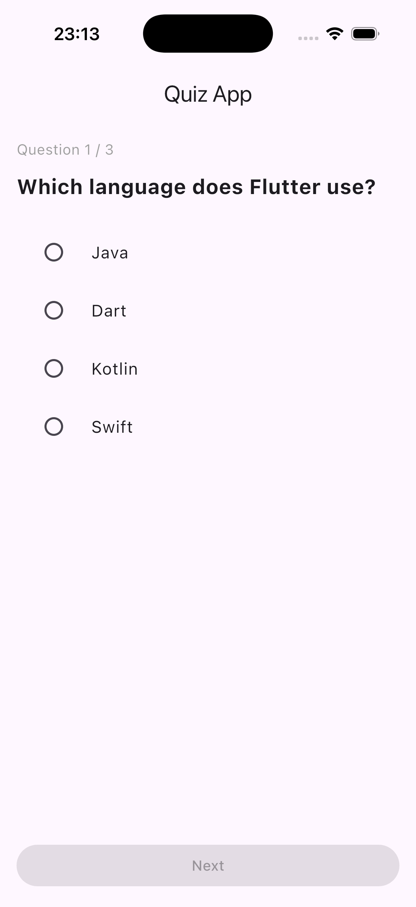
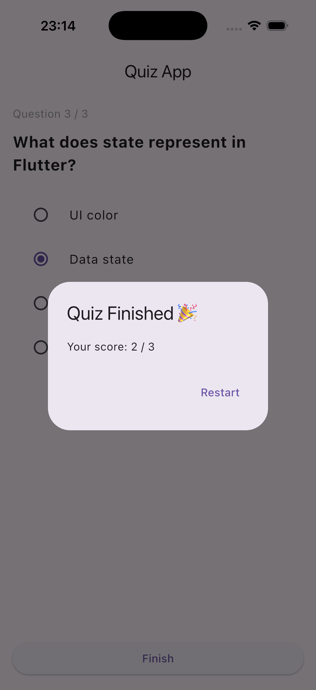

# Quiz App

🟢 **Beginner** · A simple Flutter quiz app built with `RadioListTile`.

Questions are shown one at a time. Pick an answer, tap **Next**, and after the last
question a dialog shows your score with the option to start over.

## 📸 Screenshots

<p align="center">
  
  
</p>

## What You'll Learn

- How to build a quiz app with Flutter
- How to use `StatefulWidget` and `setState` to manage quiz state
- How to model quiz data with a custom Dart class
- How to build single-choice answers with `RadioListTile`
- How to calculate a score and show the result in a dialog
- How to turn a list of data into a list of widgets with `.map()`
- How to disable a button by passing `null` to `onPressed`

## Project Structure

```
lib/
├── models/
│   └── question.dart  # The Question class
├── pages/
│   └── home_page.dart # Question list, quiz state, and the UI
└── main.dart
```

## Key Concepts

### Modeling the data

Instead of juggling three parallel lists, one class holds everything a question
needs:

```dart
class Question {
  final String question;
  final List<String> options;
  final String correctAnswer;

  Question({
    required this.question,
    required this.options,
    required this.correctAnswer,
  });
}
```

Add or edit questions in the `questions` list at the top of
`lib/pages/home_page.dart` — the UI adapts automatically.

### The whole quiz in three variables

```dart
int currentQuestionIndex = 0;
int score = 0;
String? selectedAnswer;   // null until the user picks something
```

`selectedAnswer` being nullable is what drives the **Next** button: when nothing
is selected, `onPressed` is `null`, and Flutter renders the button as disabled for
free.

```dart
ElevatedButton(
  onPressed: selectedAnswer == null ? null : () { /* ... */ },
  child: Text(isLastQuestion ? "Finish" : "Next"),
)
```

### Building options from a list

`.map()` converts each option string into a `RadioListTile`, and `.toList()` turns
the result into the `List<Widget>` that `Column` expects:

```dart
RadioGroup<String>(
  groupValue: selectedAnswer,
  onChanged: (value) {
    setState(() {
      selectedAnswer = value;
    });
  },
  child: Column(
    children: question.options.map((option) {
      return RadioListTile<String>(
        title: Text(option),
        value: option,
      );
    }).toList(),
  ),
)
```

> **Note:** `RadioGroup` is a newer Flutter API — it's why this project's
> `pubspec.yaml` asks for a recent Dart SDK. On older Flutter versions you'd set
> `groupValue` and `onChanged` on each `RadioListTile` individually instead.

## Getting Started

Prerequisites:

- Flutter SDK installed (a recent stable release, for `RadioGroup`)

Install dependencies:

```bash
flutter pub get
```

To add or regenerate platform support, run:

```bash
flutter create --platforms=android,ios,macos,windows,linux,web .
```

Run the app:

```bash
flutter run
```

## Try It Yourself

- Load the questions from a JSON file instead of hardcoding them
- Show whether the answer was right or wrong before moving on
- Add a countdown timer per question
- Shuffle the questions and options on every run
