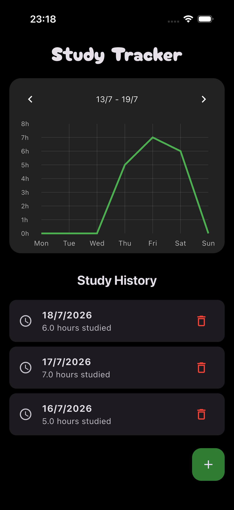
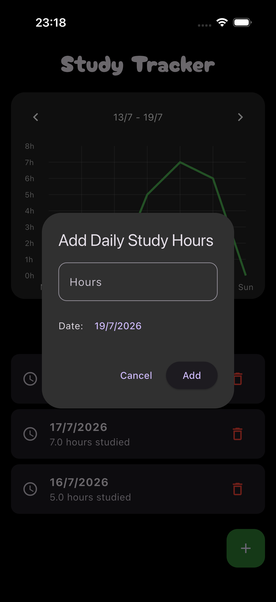

# Study Tracker

🟡 **Intermediate** · A Flutter app for tracking how many hours you study each day.

Log hours for any date with the ➕ button, see the current week plotted as a line
chart, page back through previous weeks, and delete entries with an undo option.
Everything is saved on-device, so it survives restarts.

## 📸 Screenshots

<p align="center">
  
  
</p>

## What You'll Learn

- How to build a simple Flutter app
- How to use basic state management with `setState`
- How to save data locally with `SharedPreferences`
- How to show a chart with simple weekly data
- How to add, delete, and restore entries
- How to use `google_fonts` for custom text styles
- How to encode a `Map` as JSON so it can be stored as a single string
- How to pass callbacks down to child widgets ("lifting state up")
- How to update a dialog's own state with `StatefulBuilder`
- How to offer an **Undo** action on a `SnackBar`
- How to define a reusable `ThemeData` in its own file

## Project Structure

```
lib/
├── components/
│   ├── study_chart.dart # fl_chart line chart + week navigation
│   └── study_list.dart  # History list with delete/undo
├── pages/
│   └── home_page.dart   # Owns the data, loading, saving, and the dialog
├── theme/
│   └── theme.dart       # Dark theme definition
└── main.dart
```

`HomePage` owns all the state. The two components are `StatelessWidget`s that
receive data and callbacks — they don't know how anything is stored.

## Key Concepts

### Storing everything under one key

The data is a `Map` of date → hours, keyed by an ISO-ish `YYYY-MM-DD` string:

```dart
Map<String, double> studyData = {};   // {'2026-07-19': 2.5, ...}
```

`SharedPreferences` can't store a `Map` directly, so it's converted to a JSON
string on the way in and back on the way out:

```dart
Future<void> _loadStudyData() async {
  final prefs = await SharedPreferences.getInstance();
  final dataString = prefs.getString('study_data') ?? '{}';
  setState(() {
    studyData = Map<String, double>.from(json.decode(dataString));
  });
}

Future<void> _saveStudyData() async {
  final prefs = await SharedPreferences.getInstance();
  await prefs.setString('study_data', json.encode(studyData));
}
```

`_loadStudyData()` is called from `initState()`, so the saved data is read once
when the screen first appears.

> Why zero-pad the date (`'2026-07-19'`, not `'2026-7-19'`)? Because padded date
> strings sort correctly alphabetically — which is exactly how the history list
> orders its entries.

### Lifting state up

`StudyList` doesn't delete anything itself. It calls a function it was given, and
`HomePage` decides what that means:

```dart
// In HomePage
StudyList(
  studyData: studyData,
  onDeleteEntry: _onDeleteEntry,
  onRestoreEntry: _onRestoreEntry,
)

// In StudyList
final Function(String) onDeleteEntry;
final Function(String, double) onRestoreEntry;
```

This is the same idea `provider` formalizes in
[06 Notes App](../06_notes_app) — worth understanding in its plain form first.

### Undo with a `SnackBar`

Deleting keeps the removed values in local variables, so restoring is just putting
them back:

```dart
final deletedKey = entry.key;
final deletedValue = entry.value;

onDeleteEntry(deletedKey);

scaffoldMessenger.showSnackBar(
  SnackBar(
    content: Text('$deletedValue-hour entry deleted'),
    duration: const Duration(seconds: 5),
    action: SnackBarAction(
      label: 'Undo',
      onPressed: () => onRestoreEntry(deletedKey, deletedValue),
    ),
    behavior: SnackBarBehavior.floating,
  ),
);
```

### A dialog that updates itself

A dialog is built in its own context, so the surrounding `setState` won't rebuild
it. `StatefulBuilder` gives it a local `setDialogState` for things like the picked
date:

```dart
showDialog(
  context: context,
  builder: (context) => StatefulBuilder(
    builder: (context, setDialogState) => AlertDialog(
      // ... calling setDialogState() here rebuilds only the dialog
    ),
  ),
);
```

### The chart

`fl_chart` wants a list of `FlSpot(x, y)` points. Here `x` is the weekday (0–6) and
`y` is the hours, with missing days falling back to `0.0`:

```dart
final hours = studyData[dateKey] ?? 0.0;
return FlSpot(index.toDouble(), hours);
```

`currentWeekIndex` is how many weeks back you're looking — `0` is this week, `1`
last week, and so on. Paging forward is blocked past the current week by passing
`null` to `onNextWeek`, which disables the button.

## Packages Used

- [shared_preferences](https://pub.dev/packages/shared_preferences) — simple local key/value storage
- [fl_chart](https://pub.dev/packages/fl_chart) — the line chart
- [google_fonts](https://pub.dev/packages/google_fonts) — fonts fetched at runtime, no asset files needed

## Getting Started

Prerequisites:

- Flutter SDK installed

Install dependencies:

```bash
flutter pub get
```

To add or regenerate platform support, run:

```bash
flutter create --platforms=android,ios,macos,windows,linux,web .
```

Run the app:

```bash
flutter run
```

## Try It Yourself

- Add up the week's total and show it above the chart
- Add hours to an existing day instead of overwriting it
- Track study subjects, and give each one its own line on the chart
- Add a monthly view alongside the weekly one
