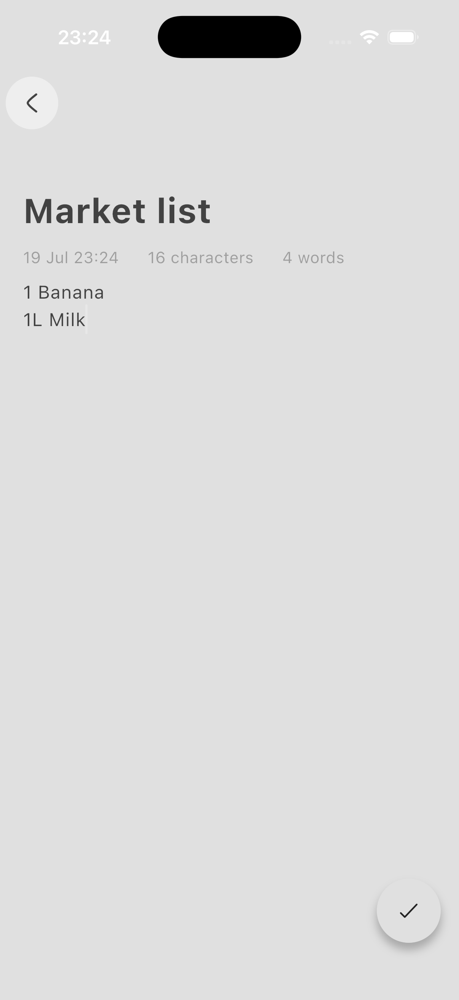
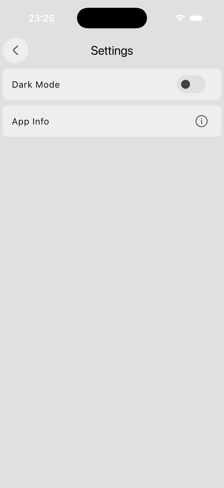

# Note Taking App

🔴 **Advanced** · A minimal Flutter note-taking app powered by `isar_community`.

Create, edit, search and delete notes, all stored in a local database. Swipe a note
away to delete it (with undo), watch the live character and word count as you type,
and toggle between light and dark themes from the settings page — the choice is
remembered.

This is the most complete project in the repo: it's the one where a real state
management solution and a real database replace `setState` and a `Map`.

## 📸 Screenshots

<p align="center">
  
  
  
</p>

## What You'll Learn

- How to build a simple note-taking app with Flutter
- How to use the `provider` package for state management
- How to store data locally with Isar
- How to create, edit, delete, and search notes
- How to switch between light and dark themes
- How to expose app state with `ChangeNotifier` and `notifyListeners()`
- How to register several providers at once with `MultiProvider`
- How to choose between `context.watch` and `context.read`
- How to generate database code with `build_runner`
- How to build swipe-to-delete with `Dismissible`
- How to build a collapsing header with `CustomScrollView` and `SliverAppBar`
- How to drive `TextField`s with `TextEditingController` and `FocusNode`
- How to format dates with `intl`

## Project Structure

```
lib/
├── components/
│   ├── my_button.dart   # Round icon button used across the app
│   └── note_tile.dart   # One note row + swipe-to-delete
├── models/
│   ├── note.dart        # The Isar collection
│   └── note.g.dart      # Generated — don't edit by hand
├── pages/
│   ├── home_page.dart   # Note list, search, sliver app bar
│   ├── edit_page.dart   # Create/edit a note
│   └── settings_page.dart
├── services/
│   └── note_service.dart # Database access + ChangeNotifier
├── theme/
│   ├── theme.dart        # Light and dark ThemeData
│   └── theme_provider.dart
└── main.dart
```

The important split: **`services/` talks to the database, `pages/` only talks to
`services/`.** No widget opens a transaction itself.

## Key Concepts

### `ChangeNotifier` — state that announces its own changes

`NoteService` holds the notes and calls `notifyListeners()` whenever they change.
Every widget listening to it rebuilds automatically:

```dart
class NoteService extends ChangeNotifier {
  List<Note> _currentNotes = [];
  List<Note> get currentNotes => _currentNotes;

  set currentNotes(List<Note> notes) {
    _currentNotes = notes;
    notifyListeners();   // ← tells the UI to rebuild
  }

  Future<void> fetchNotes() async {
    currentNotes = await isar.notes.where().findAll();
  }
}
```

### Registering providers

`MultiProvider` puts both the note data and the theme above the whole app, so any
screen can reach them:

```dart
void main() async {
  WidgetsFlutterBinding.ensureInitialized();   // required before async setup
  await NoteService.initialize();              // open the database first

  runApp(
    MultiProvider(
      providers: [
        ChangeNotifierProvider(create: (context) => NoteService()),
        ChangeNotifierProvider(create: (context) => ThemeProvider()),
      ],
      child: const MainApp(),
    ),
  );
}
```

### `watch` vs `read`

This trips up almost everyone learning `provider`:

```dart
// In build() — subscribe, and rebuild when the notes change
final noteService = context.watch<NoteService>();

// In a callback — just call a method, don't subscribe
context.read<NoteService>().deleteNote(note.id);
```

Rule of thumb: **`watch` in `build`, `read` in callbacks.** Using `watch` inside a
callback subscribes a widget that isn't rebuilding; using `read` in `build` means
your UI won't update.

### The Isar collection

The model is a plain class with an `@Collection()` annotation. The `part` line
points at generated code:

```dart
import 'package:isar_community/isar.dart';

part 'note.g.dart';

@Collection()
class Note {
  Id id = Isar.autoIncrement;
  late String title;
  late String content;
  DateTime? updatedAt;
}
```

`note.g.dart` is **generated, not written**. Regenerate it after changing the
model:

```bash
dart run build_runner build --delete-conflicting-outputs
```

### Reads and writes

Reads are direct; anything that modifies data goes inside `writeTxn`:

```dart
// Write
await isar.writeTxn(() => isar.notes.put(newNote));

// Query — search title OR content, case-insensitively
return isar.notes
    .filter()
    .titleContains(query, caseSensitive: false)
    .or()
    .contentContains(query, caseSensitive: false)
    .findAll();
```

### Swipe to delete, with undo

`Dismissible` needs a **stable, unique `key`** so Flutter can tell rows apart when
one is removed — the note's database id is perfect for it:

```dart
Dismissible(
  key: Key(note.id.toString()),
  direction: DismissDirection.endToStart,
  onDismissed: (direction) => _handleDismissed(context),
  background: _buildDismissibleBackground(),   // the red delete strip
  child: _buildListTile(context),
)
```

Undo re-inserts the note **with its original id**, so it lands back where it was
rather than jumping to the end of the list — that's what `addNoteWithId` is for.

### Persisted theme switching

`ThemeProvider` is a second `ChangeNotifier`, this time backed by
`shared_preferences` so the choice survives a restart:

```dart
void toggleTheme() {
  themeData = (_themeData == lightTheme) ? darkTheme : lightTheme;
  _saveTheme();
}
```

`MaterialApp` reads it at the top of the tree:

```dart
theme: Provider.of<ThemeProvider>(context).themeData,
```

## Official Package Docs

- [provider](https://pub.dev/packages/provider)
- [isar_community](https://pub.dev/packages/isar_community)
- [isar_community_flutter_libs](https://pub.dev/packages/isar_community_flutter_libs)
- [path_provider](https://pub.dev/packages/path_provider)
- [shared_preferences](https://pub.dev/packages/shared_preferences)
- [intl](https://pub.dev/packages/intl)
- [hugeicons](https://pub.dev/packages/hugeicons)
- [flutter_launcher_icons](https://pub.dev/packages/flutter_launcher_icons)

> `isar_community` is a maintained fork of the original `isar` package, which is no
> longer actively updated.

## Getting Started

Prerequisites:

- Flutter SDK installed

Install dependencies:

```bash
flutter pub get
```

To add or regenerate platform support, run:

```bash
flutter create --platforms=android,ios,macos,windows,linux,web .
```

The generated `lib/models/note.g.dart` is committed, so the app runs as-is. If you
change `lib/models/note.dart`, regenerate it:

```bash
dart run build_runner build --delete-conflicting-outputs
```

Run the app:

```bash
flutter run
```

App icons are configured through `flutter_launcher_icons` in `pubspec.yaml`.
Regenerate them after replacing `assets/icons/ic_launcher.png`:

```bash
dart run flutter_launcher_icons
```

## Try It Yourself

- Pin important notes to the top of the list
- Add tags or folders, and filter by them
- Add a grid/list view toggle
- Sync notes to a backend so they work across devices
