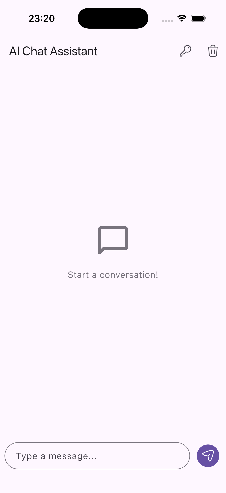

# AI Chat Assistant

🟡 **Intermediate** · AI chatbot application powered by REST API and Provider.

A clean, modern chat interface that sends user prompts to an LLM API via REST requests (`http`) and manages conversation state dynamically with Provider.

## 📸 Screenshots

<p align="center">
  
</p>

## What You'll Learn

- Making HTTP `POST` requests with JSON payloads and headers using the `http` package
- Managing async state and conversation history using `Provider` (`ChangeNotifier`)
- Controlling list position with `ScrollController` to auto-scroll on new messages
- Constructing custom chat bubbles and Material 3 layouts
- Handling API keys safely through runtime UI inputs

## Project Structure

```
lib/
├── components/
│   └── chat_bubble.dart       # Styled message bubble widget
├── models/
│   └── message.dart           # Plain Dart data class representing a chat message
├── pages/
│   └── chat_page.dart         # Main chat screen with list view and input field
├── providers/
│   └── chat_provider.dart     # State management for chat history and loading state
├── services/
│   └── claude_api_service.dart # Handles HTTP requests to the Anthropic API
└── main.dart                  # Entry point wrapping the app with Provider
```

## Key Concepts

### 1. Sending HTTP POST Requests to an LLM API

The `ClaudeApiService` formats the JSON request body and headers (`anthropic-version`, `x-api-key`) and sends it via `http.post`:

```dart
final response = await http.post(
  Uri.parse(_baseUrl),
  headers: {
    'anthropic-version': _apiVersion,
    'content-type': 'application/json',
    'x-api-key': apiKey,
  },
  body: jsonEncode({
    'model': _model,
    'messages': [
      {'role': 'user', 'content': prompt},
    ],
    'max_tokens': _maxTokens,
  }),
);
```

### 2. Provider State Management

`ChatProvider` manages loading indicators, list updates, and notifies listeners whenever a message is sent or received:

```dart
Future<void> sendMessage(String prompt) async {
  _messages.add(userMessage);
  _isLoading = true;
  notifyListeners();

  try {
    final responseText = await apiService.sendMessage(prompt);
    _messages.add(Message(content: responseText, isUser: false, timestamp: DateTime.now()));
  } catch (e) {
    _messages.add(Message(content: 'Error: $e', isUser: false, timestamp: DateTime.now()));
  } finally {
    _isLoading = false;
    notifyListeners();
  }
}
```

### 3. Auto-Scrolling to the Latest Message

Using `ScrollController`, the app animates to the bottom whenever new messages arrive:

```dart
void _scrollToBottom() {
  WidgetsBinding.instance.addPostFrameCallback((_) {
    if (_scrollController.hasClients) {
      _scrollController.animateTo(
        _scrollController.position.maxScrollExtent,
        duration: const Duration(milliseconds: 300),
        curve: Curves.easeOut,
      );
    }
  });
}
```

## Getting Started

1. Navigate to this project folder:
   ```bash
   cd projects/08_ai_chat
   ```

2. Generate the platform folders:
   ```bash
   flutter create --platforms=android,ios,macos,windows,linux,web .
   ```

3. Install dependencies:
   ```bash
   flutter pub get
   ```

4. Run the app:
   ```bash
   flutter run
   ```

5. Click the **Key icon** in the top AppBar to enter your Anthropic API Key (`sk-ant-...`) and start chatting!

## Try It Yourself

1. **Add Markdown Support**: Use the `flutter_markdown` package to render formatted text and code snippets from AI responses.
2. **Switch Models**: Add a dropdown menu allowing users to select different models (e.g. `claude-3-haiku` vs `claude-3-5-sonnet`).
3. **Local Storage**: Save conversation history to local storage using `shared_preferences` so messages persist between app restarts.
