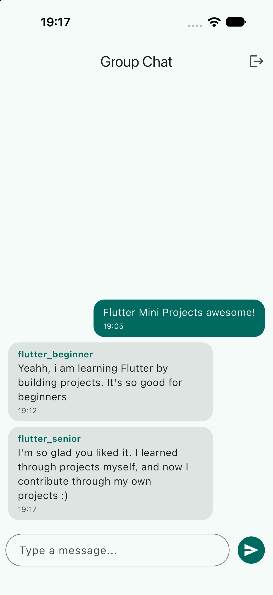

# Group Chat

🔴 **Advanced** · A realtime group chat backed by Supabase.

Sign up with a username, email and password, then chat with everyone else in one
shared room. New messages show up instantly on every device, with no refresh and no
polling.

## 📸 Screenshots

<p align="center">
  
</p>

## What You'll Learn

- Signing users up, in and out with Supabase Auth
- Switching between the login and chat screens with a `StreamBuilder` on auth state
- Listening to a database table in realtime with `.stream()`
- Using a reversed `ListView` so the newest message stays in view
- Protecting data with Row Level Security (RLS) policies
- Keeping keys out of the source code with `--dart-define`

## Project Structure

```
lib/
├── components/
│   └── message_bubble.dart   # One chat bubble: sender name, text and time
├── models/
│   └── message.dart          # Message data class, built from a Supabase row
├── pages/
│   ├── chat_page.dart        # Live message list and the input field
│   └── login_page.dart       # Sign-in / sign-up form
├── services/
│   └── chat_service.dart     # Every Supabase call (auth + messages) lives here
└── main.dart                 # Supabase setup and the AuthGate
supabase/
└── schema.sql                # The messages table, its security rules, and Realtime
```

## Key Concepts

### 1. Realtime messages with `.stream()`

A normal query returns data once. `.stream()` returns the current rows, then pushes a
fresh list every time the table changes:

```dart
Stream<List<Message>> messagesStream() {
  return _supabase
      .from('messages')
      .stream(primaryKey: ['id'])
      .order('created_at', ascending: false)
      .limit(100)
      .map((rows) => rows.map(Message.fromMap).toList());
}
```

The page creates this stream once in `initState` and hands it to a `StreamBuilder`.
Creating it inside `build()` would open a new connection on every rebuild.

### 2. Newest message at the bottom, without a `ScrollController`

The stream gives messages newest first. A `ListView` with `reverse: true` draws
the first item at the bottom and starts scrolled to the bottom, so the latest message
is always in view:

```dart
return ListView.builder(
  reverse: true,
  itemCount: messages.length,
  itemBuilder: (context, index) {
    final message = messages[index];
    return MessageBubble(
      message: message,
      isMine: message.userId == _chatService.currentUserId,
    );
  },
);
```

### 3. An AuthGate instead of manual navigation

The login page never calls `Navigator`. `AuthGate` listens to auth changes and
shows the right screen on its own, including after signing out:

```dart
return StreamBuilder<AuthState>(
  stream: auth.onAuthStateChange,
  builder: (context, snapshot) {
    return auth.currentSession == null
        ? const LoginPage()
        : const ChatPage();
  },
);
```

### 4. Let the database fill in who sent a message

The app only sends the text:

```dart
await _supabase.from('messages').insert({'content': content});
```

The database fills in `user_id` and `username` from the signed-in user. An RLS policy
then rejects any message that claims to come from someone else:

```sql
user_id uuid not null default auth.uid() ...,
username text not null default (auth.jwt() -> 'user_metadata' ->> 'username'),

create policy "Users can send messages as themselves"
  on public.messages for insert
  to authenticated
  with check (
    user_id = (select auth.uid())
    and username = (select auth.jwt() -> 'user_metadata' ->> 'username')
  );
```

## Getting Started

This project needs a free [Supabase](https://supabase.com) project.

1. **Create the database.** In a new Supabase project, open **SQL Editor**, paste in
   [`supabase/schema.sql`](supabase/schema.sql) and click **Run**.

2. **(Optional) Skip email confirmation while testing.** Under
   **Authentication → Sign In / Providers**, turn off **Confirm email**.
   New accounts can then sign in immediately.

3. **Find your URL and key.**
   - **Project URL:** go to **Project Settings → General**, copy the
     **Project ID**, and build the URL as `https://<project-id>.supabase.co`.
     You can also click **Connect** in the top bar to copy the full URL.
   - **Key:** under **Project Settings → API Keys**, copy the
     **publishable key** (`sb_publishable_...`). A legacy `anon` key also works.

   Both are safe to put in an app, because RLS is what protects the data.
   Never use the **secret** key (`sb_secret_...`) in the app.

4. Navigate to this project folder and generate the platform folders:

   ```bash
   cd projects/09_group_chat
   flutter create --platforms=android,ios,macos,windows,linux,web .
   ```

5. Install dependencies and run with your keys:
   ```bash
   flutter pub get
   flutter run \
     --dart-define=SUPABASE_URL=https://your-project.supabase.co \
     --dart-define=SUPABASE_KEY=your-publishable-key
   ```

Sign up with two accounts (for example, one on the web and one on a phone) to watch
messages arrive live.

> **macOS:** the app needs network access. Add
> `<key>com.apple.security.network.client</key><true/>` to
> `macos/Runner/DebugProfile.entitlements` and `Release.entitlements`.

## Try It Yourself

1. **Online users**: Use Supabase Realtime [Presence](https://supabase.com/docs/guides/realtime/presence) to show who is in the chat right now.
2. **Delete your own messages**: Add a `delete` RLS policy and a long-press menu on your bubbles.
3. **Multiple rooms**: Add a `rooms` table and a `room_id` column, then filter the stream with `.eq('room_id', roomId)`.
